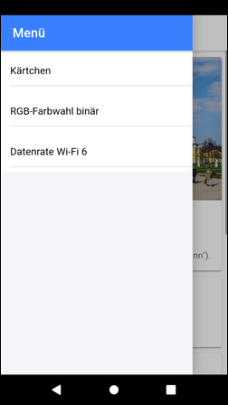
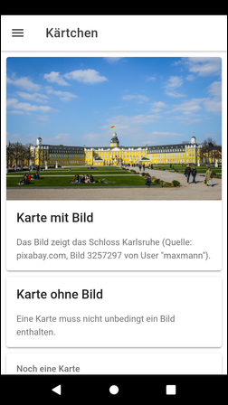
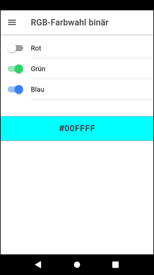
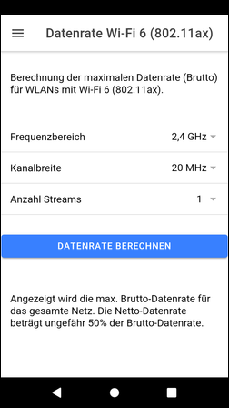

# Ionic app to demonstrate several UI Components #

The Ionic app contained in this repository demonstrates the following UI components:
* Page 1 (home): [ion-card](https://ionicframework.com/docs/api/card) and [ion-img](https://ionicframework.com/docs/api/img), the latter one for displaying an imags contained in the application.
* Page 2: [ion-toggle](https://ionicframework.com/docs/api/toggle)
* Page 3: [ion-select](https://ionicframework.com/docs/api/select)

 

----

## Screenshots ##

    
    

 

----

## License ##

See the [LICENSE file](LICENSE.md) for license rights and limitations (GPL v3) for the files in this repository.

The project contains [this image](https://pixabay.com/de/photos/schloss-karlsruhe-baden-w%C3%BCrttemberg-3257297/) from [User "maxmann](https://pixabay.com/de/users/maxmann-665103/)
at `pixabay.com`. 
